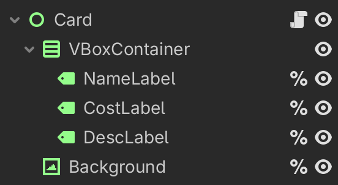
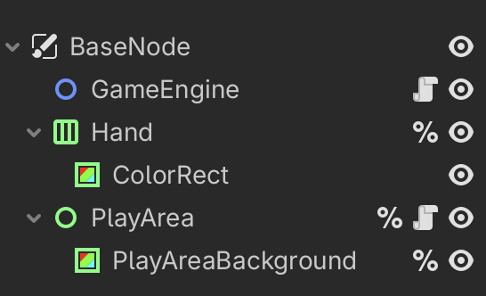
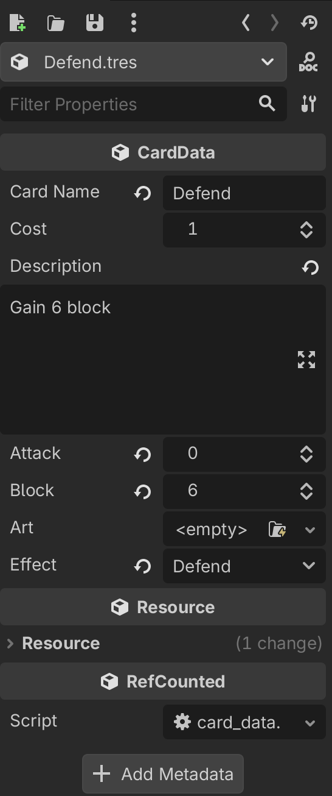

# Card Game Template

General gist is to create an easily readable, human modifiable card resource that can be read into an engine.

## Project Setup

There are four basic components:

1. EventBus (Signals)
2. Card Scene
3. Game Scene
4. Data Models

### Event Bus

The event bus tutorial [can be found here.](../EventBusSignals/README.md) In this project, it'll handle what happens when a card is dragged on top of the play area.

### Card Scene



Basic premise is a control node that contains all the UI elements we need, we'll keep most of the labels uniquely accessible to make populating this data easier.

```
# card.gd

class_name Card
extends Control

@onready var name_label: Label = %NameLabel
@onready var cost_label: Label = %CostLabel
@onready var desc_label: Label = %DescLabel
@onready var background: TextureRect = %Background
@export var data: CardData

func _ready() -> void:
	if data:
		setup(data)
		
func setup(card_data: CardData) -> void:
	data = card_data
	name_label.text = data.card_name
	cost_label.text = str(data.cost)
	desc_label.text = data.description
	if data.art:
		background.texture = data.art

func _get_drag_data(_at_position: Vector2) -> Variant:
	var preview := duplicate()
	preview.modulate = Color(1, 1, 1, 0.7)
	set_drag_preview(preview)
	return self
```

Most of the code is basic boilerplate and shouldn't come as a surprise.

The interseting bit of code is actually the `_get_drag_data()` function. This function is actually a private virtual function we've overridden on the Godot engine itself.

Essentially, it allows us to specifiy what exactly happens when a control object is being dragged across the viewport. In this case, we're creating a `preview` that is a duplicate of `self` which is an instance of `Card`.

`set_drag_preview(preview)` is another method that sets the node/texture/image to render as the user drags.

`return self` is also important to let the function know what data to pass along to the relevant control recipients when the drag is released.

### Game Scene



There are two main scripts, one attached to `PlayArea` and another attached to `GameEngine`

#### PlayArea

```
# play_area.gd

extends Control
	
@onready var background: ColorRect = %PlayAreaBackground

func _ready() -> void:
	background.mouse_filter = Control.MOUSE_FILTER_PASS
	
func _can_drop_data(_at_position: Vector2, data: Variant) -> bool:
	return data is Card
	
func _drop_data(_at_position: Vector2, data: Variant) -> void:
	var card: Card = data as Card
	EventBus.card_played.emit(card)
```

The PlayArea control node itself also contains two virtual private functions: `_can_drop_data()` and `_drop_data()`

`_can_drop_data(_at_position: Vector2, data: Variant) -> bool` - This function is executed by Godot (similar to `_process()` on Node2D) when you're dragging something on top of a control surface.

`_drop_data()` - Actually executes when the drag is release, only if `_can_drop_data()` returns `true` otherwise doesn't do anything.

In our code block for `_can_drop_data()` we have a truthy statement that checks if the `data` field is a type `Card`. If you remember from the previous card scene, we defined `_get_drag_data()` to return a type `Card`, that means if we have other dragable control nodes they won't pass their data into this function since we don't accept anything other than type `Card`.

The `_drop_data()` function creates a card instance from the data we received, and emits a signal letting the engine know a valid card has been dragged and dropped in a valid location.

#### GameEngine

```
extends Node2D

@onready var PlayArea: Control = %PlayArea
@onready var Hand: Control = %Hand
@onready var CardScene := preload("res://card_scene/card.tscn")
@onready var Strike: CardData = preload("res://cards/Strike.tres")
@onready var Defend: CardData = preload("res://cards/Defend.tres")
@onready var Draw: CardData = preload("res://cards/Draw.tres")

func _ready() -> void:
	var cardstrike = CardScene.instantiate()
	cardstrike.data = Strike
	var carddefend = CardScene.instantiate()
	carddefend.data = Defend
	var carddraw = CardScene.instantiate()
	carddraw.data = Draw
	Hand.add_child(cardstrike)
	Hand.add_child(carddefend)
	Hand.add_child(carddraw)
	EventBus.connect("card_played", _on_card_played)
	
func _on_card_played(card: Card) -> void:
	var card_data := card.data
	print(card_data)
	print("played")

```

The code in this block is mainly scaffolding for the PoC. None of these custom resources should be instantiated in this way, and rather should be created via code when the game instance is readied.

The important block is `_on_card_played()` which is connected to the `card_played` signal from the EventBus.

In this example we simply print the data and state that it has been played. If there were engine logic we would have a `match..case` statement that determines what happens when a card is played.

### Data Models

```
class_name CardData
extends Resource

@export var card_name: String = "Strike"
@export var cost: int = 1
@export_multiline var description: String = "Deal 6 damage"
@export var attack: int = 6
@export var block: int = 0
@export var art: Texture2D

enum Effect { ATTACK, DEFEND, DRAW }
@export var effect: Effect = Effect.ATTACK
```

We have covered custom resources [in this template here.](../AdvancedCustomResourcesTemplate/README.md) The basic premise is the same, to create an easily reproducible resource that is human readable.

As an added plus, it is editor friendly as well:



But can also be created through code, and saved into a JSON serializable object that can be read to and from for larger batches of cards.
